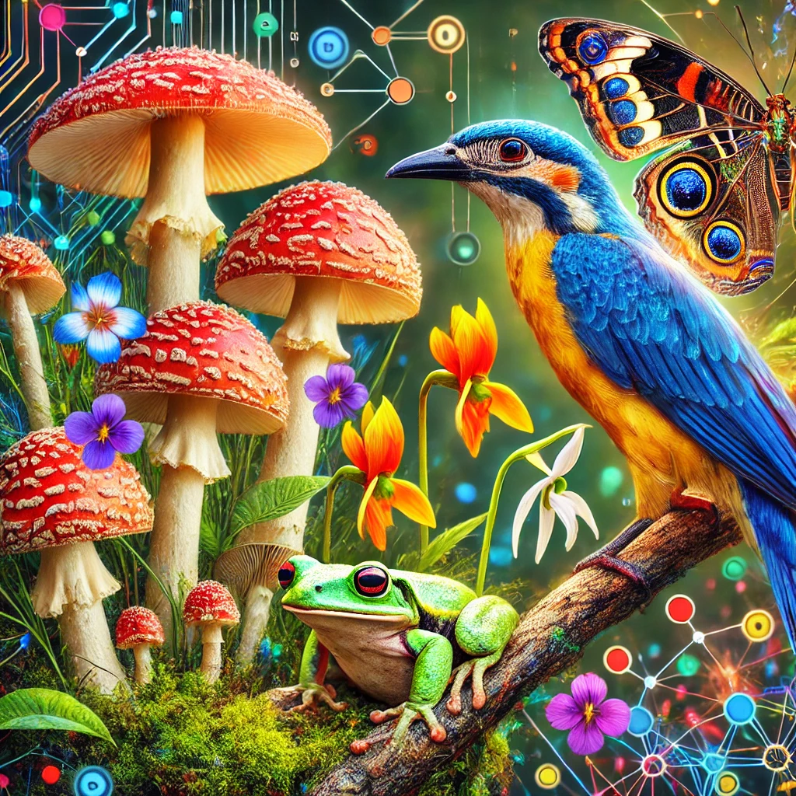

#+TITLE=iNaturalistML
#+DESCRIPTION: Independent Undergraduate Research into ML/CV using the 2021 iNaturalist Dataset

#+attr_html: :width 600px:

- Image credit: DALL-E, OpenAI

* Overview:
- About the dataset:
  This dataset from iNaturalist has arisen from several previous competitions. To this project's benefit, names of species are provided upfront; this should mean that a model can be trained and evaluated for initial accuracy because the bulk of images should be properly identified (no need to scrape the host site). This should allow for more focus on some of the more experimental ideas, such as *using synthetic data* to improve accuracy.

* Goals for This Project:
- *Address Ethics Concerns:*
  - In the case of mushrooms, misidentification could be deadly.
  - Synthetic data can alleviate some of the copyright headache (MIT).
  - Use transparent Machine Learning practices where possible.
    - Increase confidence to the users for critical use cases, like mushroom identification.
  - *Perhaps the model should have disclaimers anytime it's identifying anything from the fungi kingdom?*
    - Snakes, carnivores...
- *Multichannel learning methods:*
  by incorporating GPS and other [[https://robots.net/tech/when-you-take-a-photo-using-your-smartphone-what-kind-of-data-is-the-photo/][metadata]] commonly found in smartphone photos, the ML algorithim could improve beyond visual cues only.
  - Plants change appearance with the seasons.
  - *Crowdsourcing and user-reported* data could strengthen a model over time. (Google Maps, Waze...)
  - Rare species are not as well-represented in the dataset (use case for synthetic data from models like DALL-E).
- *Diversity and Equality:*
  - Experiment with using [[https://news.mit.edu/2022/synthetic-data-ai-improvements-1103][synthetic data (MIT)]] (i.e. DALL-E) for specimens lacking in the training dataset. This technology wasn't nearly as advanced in 2021 as it is now in 2025.
  - *Lightweight Computation:*
    An emphasis on keeping the trained model as resource-friendly as possible
    - Safety & survival in dire circumstances
    - Accessible to poor communities using legacy hardware
    - Responsible Computer Science project, considering the environmental impact of the electricity that AI projects often require
    - Simplicity encourages innovation
  - *Crowdsourcing:* iNaturalist relies on user-submitted photos. Areas with lower access to technology and/or internet, or are very remote, don't have their local ecology as well-represented.
    - *Handling of Anomalous data:*
      If the model doesn't recognize an animal, perhaps there's a reason that should be investigated? i.e. it's a
      - species believed to be extinct
      - new species, or outside its expected habitat. *The implications of catching this could be very relevant to science.*

* Dataset:
[[https://github.com/visipedia/inat_comp/tree/master/2021#annotation-format-notes][iNaturalist Dataset]]
